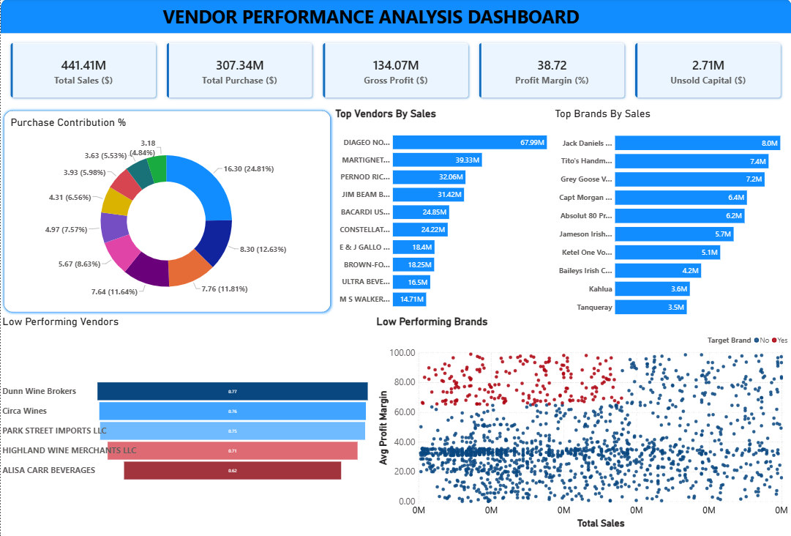

# 📊 Vendor Performance Analysis

An end-to-end Data Analytics project that analyzes vendor purchasing and sales performance using **MySQL, Python, Statistical Analysis, and Power BI**. The project consolidates data from multiple business tables, performs exploratory data analysis, validates business hypotheses, and presents actionable insights through an interactive dashboard.

---

## 📌 Project Overview

Organizations often store procurement, inventory, and sales information across multiple databases, making it difficult to evaluate vendor performance efficiently.

This project integrates multiple datasets into a single analytical model to answer key business questions related to:

- Vendor purchasing performance
- Sales performance
- Inventory efficiency
- Profitability
- Stock turnover
- Capital locked in inventory

The final output is an interactive Power BI dashboard that enables quick business decision-making.

---

## 🎯 Business Objectives

The analysis aims to answer the following questions:

- Which vendors generate the highest sales revenue?
- Which brands contribute the most to overall sales?
- Which vendors contribute the highest purchase volume?
- Which vendors have poor inventory turnover?
- How much capital is locked in unsold inventory?
- Is there a significant difference in profit margins between high-performing and low-performing vendors?
- Which brands have high profit margins despite low sales?

---

## 🛠️ Tech Stack

- **Python**
  - Pandas
  - NumPy
  - Matplotlib
  - Seaborn
  - SciPy

- **Database**
  - MySQL
  - SQLAlchemy
  - PyMySQL

- **Business Intelligence**
  - Microsoft Power BI

- **Notebook Environment**
  - Jupyter Notebook

---

## 📂 Project Structure

```
Vendor-Performance-Analysis
│
├── dashboard
│   ├── Vendor_Performance_Dashboard.pbix
│   └── Vendor_Performance_Dashboard.png
│
├── data
│   ├── purchase_prices.csv
│   ├── vendor_invoice.csv
│   └── vendor_sales_summary.csv
│
├── notebooks
│   ├── Data_loading.ipynb
│   ├── Exploratory_Data_Analysis.ipynb
│   └── Vendor_Performance_Analysis.ipynb
│
└── README.md
```

---

## 🗄️ Data Processing

The project begins by integrating multiple datasets stored in MySQL.

The following tables were analyzed:

- Purchases
- Purchase Prices
- Sales
- Vendor Invoice

SQL joins and aggregations were used to create a consolidated analytical table:

**vendor_sales_summary**

The summary table includes:

- Purchase Quantity
- Purchase Cost
- Sales Quantity
- Sales Revenue
- Gross Profit
- Profit Margin
- Freight Cost
- Stock Turnover
- Sales-to-Purchase Ratio

This optimized table significantly reduces query execution time during analysis and dashboard creation.

---

## 📈 Exploratory Data Analysis

Comprehensive exploratory data analysis was performed using Python.

### Data Validation

- Missing value analysis
- Summary statistics
- Distribution analysis
- Outlier detection
- Correlation analysis

### Business Insights

The analysis identified several important business findings:

- High-selling vendors contribute the majority of company revenue.
- A small number of brands account for a significant percentage of total sales.
- Several vendors maintain high profit margins despite relatively low sales volumes.
- Large purchase orders achieve significantly lower unit purchase costs.
- Unsold inventory represents a substantial amount of locked working capital.
- Vendors with poor stock turnover require inventory optimization strategies.

---

## 📊 Statistical Analysis

Hypothesis testing was performed to determine whether profit margins differ significantly between high-performing and low-performing vendors.

### Hypotheses

**Null Hypothesis (H₀)**

There is no significant difference in the average profit margins between high-performing and low-performing vendors.

**Alternative Hypothesis (H₁)**

There is a significant difference in the average profit margins between high-performing and low-performing vendors.

### Method

- Two-Sample Welch's t-test
- 95% Confidence Interval

The statistical analysis provides data-driven validation of vendor performance differences rather than relying solely on descriptive statistics.

---

## 📉 Power BI Dashboard

The interactive dashboard provides a consolidated business overview including:

### KPI Cards

- Total Sales
- Total Purchase
- Gross Profit
- Profit Margin
- Unsold Capital

### Visualizations

- Purchase Contribution by Vendor
- Top Vendors by Sales
- Top Brands by Sales
- Low Performing Vendors
- Low Performing Brands
- Inventory Performance Analysis

---

## 📸 Dashboard Preview


---

## 📌 Key Business Insights

- A small number of vendors account for a large share of total purchases.
- Premium pricing strategies generate higher profit margins for selected brands.
- Bulk purchasing significantly reduces unit procurement cost.
- Inventory inefficiencies lead to considerable capital being tied up in unsold stock.
- Several vendors require inventory optimization due to consistently low stock turnover.
- Statistical testing confirms measurable differences between vendor performance groups.

---

## 🚀 Future Improvements

Possible enhancements include:

- Time-series sales forecasting
- Inventory demand prediction
- Vendor performance scoring model
- Customer segmentation
- Automated dashboard refresh using Power BI Service

---

## ▶️ How to Run

1. Clone the repository.

```
git clone https://github.com/your-username/vendor-performance-analysis.git
```

2. Install required libraries.

```
pip install -r requirements.txt
```

3. Configure your MySQL database connection by replacing:

```
YOUR_PASSWORD
```

with your local MySQL password.

4. Run the notebooks in the following order:

- Data_loading.ipynb
- Exploratory_Data_Analysis.ipynb
- Vendor_Performance_Analysis.ipynb

5. Open the Power BI dashboard (`.pbix`) to explore the interactive visualizations.

---

## 📌 Dataset

This repository contains the processed datasets required to reproduce the analysis.

Some original raw datasets are not included due to file size limitations.

---

## ⭐ Project Highlights

- End-to-End Data Analytics Workflow
- SQL Data Integration
- Python Exploratory Data Analysis
- Statistical Hypothesis Testing
- Interactive Power BI Dashboard
- Business Insight Generation
